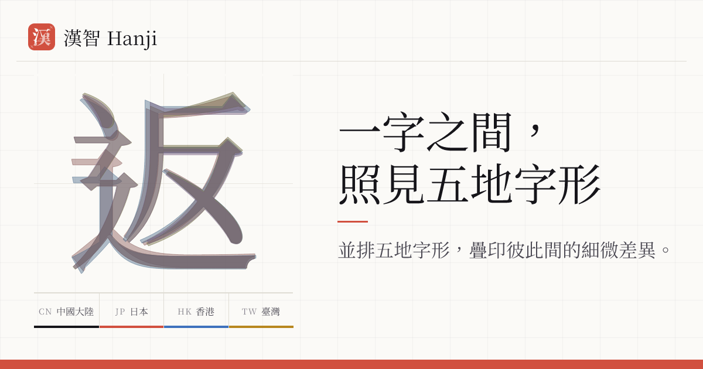

# Hanji

[简体中文](README.md) | English | [日本語](README.ja-JP.md)

<!-- When editing this file, update README.md and README.ja-JP.md in the same change. -->

> One character across five regions

Place the same Han character side by side and in overprint to reveal subtle, genuine glyph differences across Mainland China, Hong Kong, Taiwan, Japan, and South Korea.

Hanji is a character table for Han characters in common use across those five regions. It compares printed glyphs in general-purpose sans-serif and serif typefaces: the same character may take different glyph forms in different regions. The five regional forms are shown side by side, sorted by default by the frequency corpus associated with the interface language; they can also be sorted by stroke count or code point and filtered by difference pattern. South Korea has no frequency dataset, so its column is hidden by default and can be enabled in Display options.

Glyph form is only one dimension. The scope is the union of five regional common-character lists, and **characters whose glyphs are identical are included as well**. This is a reference table of Han characters across five regions, not a list of differences alone.

The following is a summary. Complete explanations are available on the in-application About page.

## The name

“Hanji” differs by one letter from three regional names for Han characters: Mandarin pinyin _hanzi_ uses z instead of j, Japanese _kanji_ uses k instead of h, and Korean _hanja_ uses a instead of i. Each region changes the same thing slightly—the subject of this application. It is also the actual Hokkien pronunciation _hàn-jī_ for “漢字”, so it is not a coined word but another regional reading. The Chinese name “汉智” follows its sound.

## Scope

Hanji includes the union of Mainland China’s _List of Commonly Used Standard Chinese Characters_ (2013), Taiwan’s _Standard Form of National Characters_ (1982), Hong Kong’s _List of Graphemes of Commonly-used Chinese Characters_, Japan’s _Jōyō Kanji List_ (2010), and South Korea’s _Basic Hanja for Educational Use_ (2000). The South Korean list contains 1,800 commonly used Hanja. After cross-code-point correspondences—including simplified and traditional forms, Japanese shinjitai and kyūjitai, and Korean variants—are merged into rows, the dataset contains **8,449 rows**. Of these, 1,692 have identical glyphs in all five regions, and 129 have five different glyphs.

Taiwan’s _List of Less Commonly Used Characters_ only supplies secondary-list status and candidates for existing rows; it does not create rows. Of its 6,343 primary entries, 3,599 unique entries are explicitly outside the product scope.

## Character groups and data semantics

Each row represents one character group. Its five columns contain the displayed forms for Mainland China, Hong Kong, Taiwan, Japan, and South Korea. Cross-code-point candidates come chiefly from OpenCC; Korean variants use correspondences listed in a Unicode IRG proposal and are constrained by regional character lists:

- When a regional list enters two characters separately, they remain separate groups, as with `着/著` and `欠/缺`.
- A self-contained same-character relation explicitly identified by OpenCC, or names whose five columns are identical, may be merged. A mapping supported by at least two regions may be treated as a confirmed regional correspondence.
- When only one region supplies evidence and a candidate also belongs to another group, Hanji conservatively keeps them separate and shows reciprocal “relationship unconfirmed” links on the detail pages, as with `鎗/槍`.

The row name is selected only after all five columns have been settled. Where evidence already exists for Mainland China, Hong Kong, Taiwan, and Japan, the previous four-region rule still selects the name so that adding the South Korean column cannot change established URLs. Both primary and parenthetical listings can preserve a group’s own name. A Japanese kyūjitai must likewise come from an explicit `JPShinjitaiCharacters` relation; it cannot be inferred merely because the row name differs from the Japanese column.

Every regional cell has a `primary` (primary listed form), `glossed` (parenthetical listed variant), or `unlisted` (not listed; a reference form is shown) state. `alternatives` stores only other forms listed by that region and confirmed to belong to the current group; `aka` records only other names for the group. Unconfirmed relations are used only for “See also” links and never enter search, URL aliases, dictionary references, or font sets. See [Data rules and known limitations](docs/known-issues.md) for complete definitions, build guarantees, and limitations.

## How glyph differences are determined

The classification uses Adobe Source Han Sans and Source Han Serif; pages render the results with their Noto Sans CJK and Noto Serif CJK counterparts. Each family uses a single glyph pool shared by Mainland China, Hong Kong, Taiwan, Japan, and South Korea, with a regional mapping from Unicode code points to glyph IDs (CIDs). Two regions are treated as sharing a glyph when their mappings point to the same CID. Adobe publishes these mappings as plain text, so comparing outlines or rendered screenshots is unnecessary.

The final classification is the **union of the sans-serif and serif results**: if either family draws two regions with one glyph, Hanji treats them as identical. This excludes design details found in only one family. Source Han Sans, for example, gives roughly one fifth of the Japanese Jōyō kanji distinct glyphs; Source Han Serif does not distinguish about 200 of them, including 了, 人, 子, 水, and 金. Hanji does not count those differences as regional conventions. See [Data rules and known limitations](docs/known-issues.md) for the complete rationale.

The page regroups cells according to this classification. Cells determined to be identical borrow one regional Noto font from their group, so they display exactly the same outline. Consequently, small region-specific differences excluded by the rule above are not shown. `tests/fonts.test.ts` extracts the actual outlines from generated fonts with fontkit and verifies character by character that classification and display agree.

An explicit cross-code-point mapping does not revert to the source code point merely because Noto or Source Han lacks its target. For example, `𬒗 → 𥗽` still displays two distinct code points. The build automatically collects code points required by the current data but absent from Noto and generates bundled supplemental WOFF2 subsets: Plangothic P1 for sans-serif and WenJin Mincho P2 for serif. The build fails explicitly if either selected font lacks a required code point. Pages always retain real Unicode text and do not depend on fonts installed on the reader’s device. These supplemental glyphs are display-only and do not participate in regional-difference classification.

## Limitations

- Hanji compares printed glyphs in general-purpose sans-serif and serif typefaces. It does not cover handwriting conventions or use textbook-style model forms as its standard. Japanese textbook typefaces are designed chiefly for Japanese instruction and have no official regional versions sharing one glyph pool with Mainland China, Hong Kong, Taiwan, and South Korea. Combining visually similar but unrelated fonts would make regional differences inseparable from the fonts’ own design differences. To control that variable, Hanji uses related font families that provide all five regional versions.
- Hanji measures the regional glyph designs in Source Han, not the regional standards themselves. It is a high-quality proxy: Adobe bases its designs on Mainland China’s _Standard Form of Printing Typefaces of Chinese Characters_, Taiwan’s _Standard Form of National Characters_, Hong Kong’s _List of Graphemes of Commonly-used Chinese Characters_, Japan’s JIS X 0208/0213, and South Korea’s KS X 1001/1002.
- Source Han’s Hong Kong glyph coverage is incomplete, so patterns in which only Hong Kong differs may be underreported.
- The filters, sorting, and detail pages use the same regional stroke counts. They first use the actual number of strokes in the stroke-order data. Hong Kong follows the stroke-order feature’s identical-glyph fallback, trying Taiwan, Mainland China, Japan, then South Korea. Where no stroke-order data is available, the fallback order is `kAlternateTotalStrokes` → Japan’s `kRSAdobe_Japan1_6` → `kTotalStrokes`. For example, the five regional stroke counts for 以 are 4/5/5/5/5.
- Korean readings use Unihan’s recommended `kHangul` values and retain every modern Hangul monosyllabic reading. Hanji does not select a reading from word context or derive additional readings under the Initial Sound Rule.
- An unlisted cell shows an inherited reference form; it does not imply that the region actually uses or officially lists that form. “Relationship unconfirmed” likewise means that the available public sources are insufficient to settle the relation.

See [docs/known-issues.md](docs/known-issues.md) for the complete data rules and build guarantees.

## Disclaimer

Hanji is a glyph-comparison tool built from public sources. It is not a regional standard, dictionary, or teaching resource. Its pages report the results of the selected data and automated rules; they do not establish that a character has only one “correct” form in a region.

Regional standards differ in scope and definition, and a typeface is only one design implementation of a standard. Hanji organizes, transforms, and merges data from different sources and supplies reference glyphs for unlisted items. These engineering choices necessarily introduce simplifications, omissions, and possible errors.

“Identical” and “different” apply only within the sources, fonts, and rules described above. Region order and grouping serve comparison only and express no ranking or position. For formal use, consult the original standards and dictionaries; every character detail page includes links to relevant regional dictionaries. The number of Han characters makes occasional errors unavoidable. Please report incorrect data through a GitHub [issue](https://github.com/sxzz/hanji/issues).

## Development

```bash
pnpm install
pnpm build:data   # Generate the character table and font subsets; the first run downloads about 302 MiB, then uses the cache
pnpm update:sources # Check and pin updated third-party data; download and regenerate when content changes
pnpm dev
pnpm dev:pwa # Enable the development Service Worker to test install UI, the manifest, and standalone mode
pnpm test
pnpm generate # Generate the static application without OG images
pnpm build:og # Optional; generate the complete OG image set
```

To debug the PWA installation experience, start `pnpm dev:pwa` and open `http://localhost:3000` in Chromium. The development Service Worker uses Network Only navigation and does not download the complete production offline cache, so it does not interfere with HMR; verify complete offline behavior against the output of `pnpm generate`. The install entry point never opens a prompt automatically and appears only when the browser provides a native installation prompt. On desktop it sits to the left of About in the navigation bar; on mobile it sits to the right of View details on the home page. It is absent in iOS, Safari, and other environments without the native install event. If an older development Service Worker still controls the page, update or unregister it in the DevTools Application panel, then reload once.

Each row uses its row name as its address (`/char/着`). The five displayed forms, `aka`, and `alternatives` also work as addresses and are redirected on the client to the owning row—for example, `/char/国`, `/char/郞`, and `/char/缐`. The page’s `rel=canonical` points back to the row-name address. Unconfirmed relations are not URL aliases.

The character table at `app/assets/data/chars.json` is generated by `pnpm build:dataset` and is **not committed**. Static generation reads the source file directly, while browsers load it from the stable `/data/chars.json` URL to avoid parsing roughly 3 MiB of JSON as JavaScript. The About page links to the same URL. It sends `Access-Control-Allow-Origin: *` and, subject to the licenses and third-party terms below, can be used cross-origin with `fetch`, XHR, or a direct link. It is cached for one hour and may remain stale for one day while it is revalidated in the background. Source and license metadata is maintained directly in `shared/sources.ts` and imported by both pages and build scripts; no `sources.json` is generated. Roughly 14 MB of font subsets is generated under `public/fonts/`, is likewise not committed, and loads on demand from stable `/fonts/*` URLs that revalidate before every reuse. Stroke-order data and flags enter Vite’s asset graph and are safely reused through long-lived immutable caching under `/_nuxt/*`. NOTICE and license texts that can change but need stable URLs live separately under `public/notices/` and must be revalidated before each use. Run `pnpm build:data` before building. Raw downloads are cached by category under the gitignored `data/raw/` directory (`charlist/`, `opencc/`, `cmap/`, `font/`, `unihan/`, `frequency/`, and `strokes/`); the build removes files restored from an old cache that no longer appear in the current source inventory.

## Deployment

This is a static application; `.output/public` can be placed on any static host. Production deployment uses [GitHub Actions](.github/workflows/deploy.yml) to build and upload the output directly to Cloudflare Workers Static Assets:

- A push to `main` deploys to production.
- A pull request targeting `main` deploys with `wrangler versions upload` to the `pr-<number>` preview alias. GitHub displays the corresponding deployment and URL on the pull request, and later commits retain the same preview URL.

The repository requires two Actions secrets:

- `CLOUDFLARE_API_TOKEN`: an API token with permission to edit Workers scripts.
- `CLOUDFLARE_ACCOUNT_ID`: the Cloudflare account ID that owns the Worker.

The Cloudflare Worker must be named `hanji`, matching `name` in `wrangler.json`.

Connect the production domain under Cloudflare **Settings → Domains & Routes**. Keep the pull-request preview URL enabled.

For page views and Web Vitals, open **Web Analytics → Add a site** in the account that owns the production domain, select the Cloudflare-proxied hostname, and use automatic setup. Cloudflare injects the beacon at the edge.

Every character-group detail page is emitted as its own HTML file. Client pages share `/data/chars.json`, and no route-specific data needs extraction, so payload extraction—which would generate an additional empty `_payload.json` for every character page—is disabled. Regional-form aliases do not get separate redirect pages: Static Assets first returns `404.html` with HTTP 404, then Nuxt client middleware navigates to the owning row. Search engines therefore do not index aliases as duplicate successful pages. Truly unknown addresses remain HTTP 404. `@nuxtjs/sitemap` writes every canonical page to `/sitemap.xml` during static generation, while `@nuxtjs/robots` generates `/robots.txt` and advertises the sitemap. Absolute URLs default to `https://hanji.sxzz.moe` and can be overridden with `NUXT_SITE_URL`; GitHub Actions first reads the repository variable of the same name and otherwise uses the repository homepage. Pull-request preview builds set `NUXT_SITE_ENV=preview` to prevent indexing. `public/_headers` gives content-hashed `_nuxt/*` assets long-lived immutable caching; stable `/fonts/*`, `/notices/*`, sitemap, and robots URLs use `no-cache`; and `/data/chars.json` uses a one-hour `max-age` with one day of `stale-while-revalidate`.

Exact commits, GitHub release tags, official attachment identifiers, and SHA-256 values for third-party assets are recorded in `data/sources.lock.json`. Run `pnpm update:sources` to upgrade them. The command resolves GitHub branches, latest releases, and Unicode versions and revalidates unversioned official direct links. When content changes, it updates the lockfile and regenerates the data immediately; when nothing changes, it skips generation. During a build, `pnpm build:data` downloads and verifies about **302 MiB** of raw data from the lockfile, including 195 MiB for ten Noto CJK fonts and about 40 MiB for two supplemental fonts. An unversioned direct link that changes without an explicit update fails checksum verification and cannot silently enter the data. Actions cache raw downloads separately from generated fonts: the former depends only on the lockfile, while the latter depends on the lockfile, the actual generation scripts, related dependencies, locales, and character table. Data generation is skipped when font inputs are completely unchanged.

Stroke-order shards are generated by `pnpm build:dataset` under `app/assets/strokes/` and are not committed. The deployment workflow rebuilds them before tests and static generation, then Vite emits content-hashed filenames. Accompanying licenses remain at stable URLs under `public/notices/` and require revalidation. Within a character group, when stroke outlines in stroke order are identical, only the first variant and its centerlines are stored, and the interface merges the corresponding regions into one choice. A page fetches its shard once and reuses the in-memory group data when regions are switched. The site uses the parsed outline count as its preferred stroke count throughout.

The built application can also be uploaded directly from a local checkout:

```bash
pnpm build:data
pnpm generate
pnpm build:og # Optional; run when the complete social-sharing asset set is required
pnpm preview:worker # http://localhost:8787
pnpm deploy
```

`pnpm generate` emits only the main site, so OG images do not block local development or deployment. To inspect the complete social-sharing assets locally, run `pnpm build:og` separately after static generation. Production GitHub Actions computes an exact hash from the generation script, glyph and font inputs, brand copy, logo, and dependency lockfile; a hit restores the complete OG directory, and a miss alone triggers full generation.

## Data sources

<!-- sources:start -->

| Use                                                                                                      | Source                                                                                                                                                                 | License                                                                                                                                           |
| -------------------------------------------------------------------------------------------------------- | ---------------------------------------------------------------------------------------------------------------------------------------------------------------------- | ------------------------------------------------------------------------------------------------------------------------------------------------- |
| Determine five-region glyph differences                                                                  | [Adobe Source Han Sans / Serif (CMap resources)](https://github.com/adobe-fonts/source-han-sans)                                                                       | [SIL OFL 1.1](https://openfontlicense.org/)                                                                                                       |
| Display typefaces                                                                                        | [Noto Sans / Noto Serif (including CJK)](https://github.com/notofonts/noto-cjk)                                                                                        | [SIL OFL 1.1](https://openfontlicense.org/)                                                                                                       |
| Supplemental sans-serif glyphs absent from Noto                                                          | [Plangothic P1](https://github.com/Fitzgerald-Porthmouth-Koenigsegg/Plangothic_Project)                                                                                | [SIL OFL 1.1](https://github.com/Fitzgerald-Porthmouth-Koenigsegg/Plangothic_Project/blob/main/LICENSE-OFL.txt)                                   |
| Supplemental serif glyphs absent from Noto                                                               | [WenJin Mincho P2](https://github.com/takushun-wu/WenJinMincho)                                                                                                        | [SIL OFL 1.1](https://github.com/takushun-wu/WenJinMincho/blob/main/LICENSE.md)                                                                   |
| Map simplified and traditional forms, Hong Kong and Taiwan variants, and Japanese shinjitai and kyūjitai | [OpenCC (Open Chinese Convert)](https://github.com/BYVoid/OpenCC)                                                                                                      | [Apache-2.0](https://www.apache.org/licenses/LICENSE-2.0)                                                                                         |
| Stroke-order animations and stroke counts for Mainland China, Taiwan, Japan, and South Korea             | [AnimCJK](https://github.com/parsimonhi/animCJK)                                                                                                                       | [Arphic Public License](https://github.com/parsimonhi/animCJK/blob/master/licenses/APL/english/ARPHICPL.TXT)                                      |
| Five regional standard character lists                                                                   | [zispace/hanzi-chars](https://github.com/zispace/hanzi-chars)                                                                                                          | [Not stated by the repository](https://github.com/zispace/hanzi-chars)                                                                            |
| Fallback stroke counts and readings                                                                      | [Unicode Han Database (Unihan)](https://www.unicode.org/reports/tr38/)                                                                                                 | [Unicode License v3](https://www.unicode.org/license.txt)                                                                                         |
| Map Korean variant forms                                                                                 | [Unicode IRG N2200 (Korean educational Hanja proposal)](https://www.unicode.org/L2/L2017/17173-irgn2200-unihan-db.pdf)                                                 | [Unicode License v3](https://www.unicode.org/license.txt)                                                                                         |
| Mainland Chinese character-frequency ranks                                                               | [hanziDB.csv (Jun Da, Modern Chinese Character Frequency List)](https://github.com/ruddfawcett/hanziDB.csv)                                                            | [MIT](https://opensource.org/licenses/MIT)                                                                                                        |
| Hong Kong character-frequency ranks                                                                      | [words.hk “Corpus Character Usage Frequency”](https://words.hk/faiman/analysis/charcount/)                                                                             | [Public Domain](https://words.hk/faiman/analysis/)                                                                                                |
| Taiwanese character-frequency ranks                                                                      | [National Academy for Educational Research, Corpus Character Frequency Table for ROC Year 112](https://teric.naer.edu.tw/wSite/ct?ctNode=645&mp=teric_b&xItem=2068770) | [Website Data Open Declaration (attribution required)](https://teric.naer.edu.tw/wSite/ct?xItem=2000016&ctNode=624&mp=teric_b&idPath=588_623_624) |
| Japanese character-frequency ranks                                                                       | [scriptin/kanji-frequency (Japanese Wikipedia)](https://scriptin.github.io/kanji-frequency/)                                                                           | [CC BY 4.0](https://creativecommons.org/licenses/by/4.0/)                                                                                         |

<!-- sources:end -->

The original standards are Mainland China’s _List of Commonly Used Standard Chinese Characters_ (2013), Taiwan’s _Standard Form of National Characters_ (1982), Hong Kong’s _List of Graphemes of Commonly-used Chinese Characters_, Japan’s _Jōyō Kanji List_ (2010) and _Grade-wise Kanji Allocation Table_ (2017), and South Korea’s _Basic Hanja for Educational Use_ (2000).

The character-by-character comparison tool [tofu.tools](https://tofu.tools/) preceded this project and likewise uses the Noto families to distinguish regional glyphs. Thanks also to the maintainers of Plangothic and WenJin Mincho for supplying supplemental glyphs for rare characters.

The fonts are subsets of Noto Sans CJK, Noto Serif CJK, Plangothic P1, and WenJin Mincho P2, all under SIL OFL 1.1, containing only characters used by Hanji. Notices are supplied at [`/notices/noto-ofl.txt`](public/notices/noto-ofl.txt), [`/notices/plangothic-ofl.txt`](public/notices/plangothic-ofl.txt), and [`/notices/wenjin-mincho-ofl.md`](public/notices/wenjin-mincho-ofl.md). Generated data files derive from the sources above and remain subject to their respective licenses. Per-source transformations and attributions are also recorded in the public [`/notices/data-sources.md`](public/notices/data-sources.md).

## License

- Source code, interface implementation, and original project documentation: [MIT](LICENSE).
- Unless otherwise stated, Hanji’s original database structure, selection and arrangement of data, and original metadata: [CC BY 4.0](https://creativecommons.org/licenses/by/4.0/).
- Third-party data and derived fields, fonts, and stroke-order data: the respective licenses listed above continue to apply.
- The Hanji name, official logo, and brand identifiers are not included in those licenses. Publicly distributed modifications, forks, and independent deployments may not use them as a name or brand without permission. They may state truthfully that they are “based on Hanji”, but must not imply official status or endorsement.

See [LICENSE](LICENSE) for the complete grant, third-party exceptions, and naming rules. © [Kevin Deng](https://github.com/sxzz)
